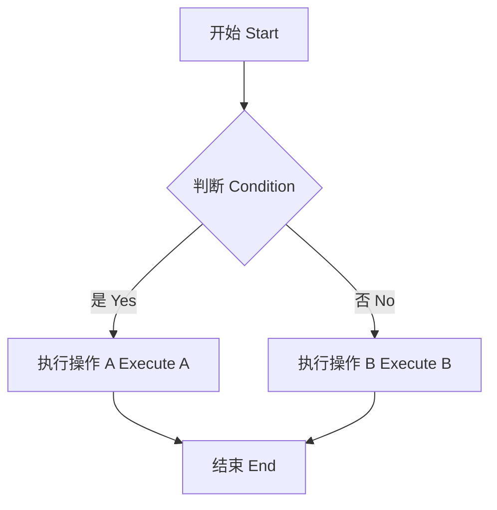
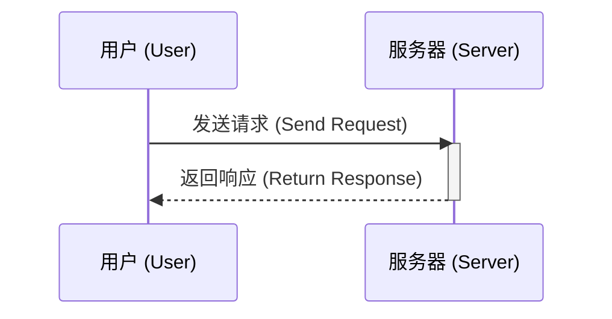
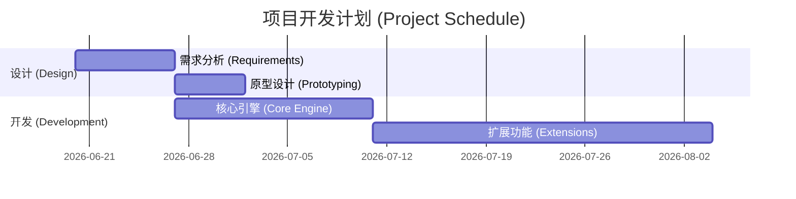

# Markdown 综合测试文档 (Comprehensive Markdown Test Document)

这是一份包含各种 Markdown 语法、扩展语法、数学公式、图表、HTML/CSS 混合以及中英文排版的综合测试文档。
This is a comprehensive test document containing various Markdown syntax, extensions, math formulas, diagrams, HTML/CSS mixing, and Chinese-English typography.

## 1. 基础排版 (Basic Typography)

### 1.1 文本样式 (Text Styles)

这是普通的段落。This is a normal paragraph. 我们可以使用 **粗体 (Bold)**，*斜体 (Italic)*，或者 ***粗斜体 (Bold Italic)***。
We can also use ~~删除线 (Strikethrough)~~ 和 `行内代码 (inline code)`。

嵌套示例 (Nested examples): **粗体中包含 *斜体* 和 `代码` (Bold with *italic* and `code`)**。
***粗斜体中包含 ~~删除线~~ (Bold italic with ~~strikethrough~~)***。

### 1.2 分割线 (Thematic Breaks)

下面是一条分割线 (Below is a thematic break):

---

## 2. 列表 (Lists)

### 2.1 无序列表 (Unordered Lists)

* 项目 1 (Item 1)
* 项目 2 (Item 2)
  * 嵌套项目 2.1 (Nested Item 2.1)
    * 深度嵌套 2.1.1 (Deep nested 2.1.1)
      * **加粗的嵌套 (Bold nested)**

### 2.2 有序列表 (Ordered Lists)

1. 第一步 (First step)
2. 第二步 (Second step)
   1. 子步骤 2.1 (Sub-step 2.1)
   2. 子步骤 2.2 (Sub-step 2.2)
      1. *带斜体的子步骤 (Sub-step with italic)*

### 2.3 任务列表 (Task Lists)

- [x] 已完成的任务 (Completed task)
- [ ] 未完成的任务 (Incomplete task)
- [ ] 包含代码的任务 `code` (Task with code)

## 3. 引用 (Blockquotes)

> 这是一个引用段落。 (This is a blockquote.)
> 
> > 这是一个嵌套的引用。 (This is a nested blockquote.)
> > - 引用中的列表 (List inside blockquote)
> > - **引用中的粗体 (Bold inside blockquote)**
> 
> 引用中的代码块 (Code block inside blockquote):
> ```python
> print("Hello from blockquote!")
> ```

## 4. 链接与图片 (Links and Images)

### 4.1 链接 (Links)

这是一个指向 [Google](https://www.google.com) 的链接。
这是一个带标题的链接 [MWRender Engine](https://github.com/xiaolingxiaoying/MarkdownRenderEngine "MarkdownRenderEngine Project")。
自动链接 (Autolinks): <https://example.com> 和 <email@example.com>。

### 4.2 图片 (Images)

这是一张本地或网络图片 (Here is an image):


[](https://markdown-here.com)

## 5. 代码与语法高亮 (Code and Syntax Highlighting)

### C++ Example

```cpp
#include <iostream>
#include <string>

// 这是一个 C++ 类 (This is a C++ class)
class HelloWorld {
public:
    void sayHello() const {
        std::cout << "Hello, Markdown Render Engine!" << std::endl;
    }
};

int main() {
    HelloWorld hw;
    hw.sayHello();
    return 0;
}
```

### JavaScript Example

```javascript
/**
 * 这是一个带有高亮的 JS 函数
 * A JS function with highlighting
 */
function calculateSum(a, b) {
  return a + b; // 返回总和 (Return the sum)
}
console.log(`Sum is: ${calculateSum(10, 20)}`);
```

## 6. 表格 (Tables)

这是一个包含不同对齐方式和中英文内容的表格。
This is a table with different alignments and mixed content.

| 特性 (Feature) | 描述 (Description) | 状态 (Status) | 优先级 (Priority) |
| :--- | :---: | ---: | :---: |
| **基础语法 (Basic Syntax)** | 支持标准的 Markdown (Supports standard Markdown) | ✅ 完成 (Done) | `High` |
| *扩展语法 (Extensions)* | 支持表格、任务列表等 (Tables, task lists, etc.) | 🚧 进行中 (WIP) | `Medium` |
| [数学公式 (Math)](#7-数学公式-math-formulas) | 支持 LaTeX 渲染 (Supports LaTeX rendering) | ❌ 待办 (Todo) | ~~Low~~ |

## 7. 数学公式 (Math Formulas)

### 7.1 行内公式 (Inline Math)

爱因斯坦的质能方程是 (Einstein's mass-energy equivalence is) $E = mc^2$。
复数形式可以写为 (Complex form can be written as) $e^{i\pi} + 1 = 0$。

### 7.2 块级公式 (Block Math)

下面是一个块级公式，展示了二次方程的求根公式：
Below is a block math formula for the quadratic formula:

$$
x = \frac{-b \pm \sqrt{b^2 - 4ac}}{2a}
$$

以及一个更复杂的矩阵示例 (And a more complex matrix example):

$$
\begin{bmatrix}
1 & x & x^2 \\
1 & y & y^2 \\
1 & z & z^2
\end{bmatrix}
$$

## 8. Mermaid 图表 (Mermaid Diagrams)

### 8.1 流程图 (Flowchart)



### 8.2 时序图 (Sequence Diagram)



### 8.3 甘特图 (Gantt Chart)



## 9. HTML 与 CSS 扩展 (HTML and CSS Extensions)

虽然 Markdown 本身很强大，但有时我们需要 HTML 和 CSS 来实现更复杂的布局。
While Markdown is powerful, sometimes we need HTML/CSS for complex layouts.

### 9.1 基础 HTML 标签 (Basic HTML Tags)

这里使用了 <u>下划线 (Underline)</u>，以及 <mark>高亮文本 (Highlighted text)</mark>。
<br>这是一行通过 `<br>` 换行的文本。(Text broken by `<br>`)
可以使用 <sup>上标 (Superscript)</sup> 和 <sub>下标 (Subscript)</sub>。

### 9.2 折叠内容 (Collapsible Content)

<details>
<summary>点击展开查看详细信息 (Click to expand for details)</summary>

这是一个隐藏的内容块。里面可以包含任何 Markdown 语法：
This is a hidden content block. It can contain any Markdown syntax:

- 列表项 A (List item A)
- 列表项 B (List item B)

> 甚至包含引用！ (Even blockquotes!)
</details>

### 9.3 内联 CSS 样式 (Inline CSS Styles)

<span style="color: red; font-weight: bold; font-size: 1.2em;">红色的加粗大号字体 (Red bold large text)</span>
<div style="background-color: #f0f8ff; padding: 10px; border-left: 5px solid #007acc; border-radius: 4px;">
    这是一个带有自定义背景色、边距和边框的 DIV 容器。(A DIV container with custom background, padding, and border.)<br>
    <strong>注意 (Note):</strong> 并不是所有的 Markdown 解析器都允许不安全的内联样式。(Not all parsers allow unsafe inline styles.)
</div>

### 9.4 复杂的 HTML 表格与结构 (Complex HTML Tables and Structure)

<table style="width:100%; border-collapse: collapse; text-align: center;">
  <tr style="background-color: #f2f2f2;">
    <th style="padding: 8px; border: 1px solid #ddd;">HTML 列 1 (Col 1)</th>
    <th style="padding: 8px; border: 1px solid #ddd;">HTML 列 2 (Col 2)</th>
  </tr>
  <tr>
    <td style="padding: 8px; border: 1px solid #ddd; color: blue;">行 1, 单元格 1 (Row 1, Cell 1)</td>
    <td style="padding: 8px; border: 1px solid #ddd; font-style: italic;">行 1, 单元格 2 (Row 1, Cell 2)</td>
  </tr>
</table>

## 10. 脚注 (Footnotes)

这是一个包含脚注的句子[^1]。这是另一个包含脚注的句子[^2]。
Here is a sentence with a footnote[^1]. Here is another one[^2].

[^1]: 这是第一个脚注的详细说明。(This is the detail of the first footnote.) 可以在这里写很长的文本。(You can write long text here.)
[^2]: 这是第二个脚注。(This is the second footnote.)
  
    脚注也可以包含多个段落，只需要缩进即可。
    (Footnotes can also contain multiple paragraphs by indenting.)

## 11. 复杂的嵌套综合测试 (Complex Nested Integration Test)

> ### 在引用中嵌套各级元素 (Nesting elements inside blockquote)
> 
> 1. 第一项 (First item)
>    - [x] 完成的设计 (Completed design)
>    - [ ] 待办的功能 (Pending features)
>      - *这里有一段斜体* (**甚至加粗了**)，带有 [链接](#) (Italic, bold, link)
>      - 行内公式测试 $a^2 + b^2 = c^2$ (Inline math test)
> 
> 2. 第二项，包含代码块和表格 (Second item with code and table)
> 
>    ```python
>    def nested_function():
>        return "Nested!"
>    ```
> 
>    | A | B |
>    |---|---|
>    | 1 | 2 |
>
> 3. HTML 也在里面 (HTML is here too)
>    <div style="color: green;">绿色的文本 (Green text)</div>

## 12. 高级数学公式测试 (Advanced Math Formula Tests)

### 12.1 分段函数 (Piecewise Functions)

$$
f(n) =
\begin{cases}
n/2,  & \text{if } n \text{ is even} \\
3n+1, & \text{if } n \text{ is odd}
\end{cases}
$$

### 12.2 多行对齐公式 (Aligned Multi-line Equations)

$$
\begin{aligned}
A &= (x + y)^2 \\
  &= x^2 + 2xy + y^2 \\
  &= (x - y)^2 + 4xy
\end{aligned}
$$

### 12.3 极限与积分 (Limits and Integrals)

$$
\lim_{x \to \infty} \left(1 + \frac{1}{x}\right)^x = e
$$

$$
\int_{-\infty}^{\infty} e^{-x^2} dx = \sqrt{\pi}
$$

## 13. 极限嵌套深度测试 (Extreme Nesting Depth Test)

* 层级 1 (Level 1)
  * 层级 2 (Level 2)
    * 层级 3 (Level 3)
      * 层级 4 (Level 4)
        * 层级 5 (Level 5)
          * 层级 6 (Level 6)
            * 层级 7 (Level 7)
              > 在第 7 层嵌套了一个引用 (Blockquote at level 7)
              > 
              > ```cpp
              > // 并且在引用里面又有一段代码
              > std::cout << "Nested to the max!" << std::endl;
              > ```

## 14. 复杂的任务列表嵌套测试 (Complex Task List Nesting Test)

- [ ] 主任务 1 (Main Task 1)
  - [x] 子任务 1.1 (Subtask 1.1)
  - [ ] 子任务 1.2 (Subtask 1.2)
    - [x] 孙任务 1.2.1 (Grand-subtask 1.2.1)
      - [ ] 曾孙任务 1.2.1.1 (Great-grand-subtask 1.2.1.1)
        > 任务列表中的引用 (Blockquote inside task list)
        > - [x] 引用内的任务 (Task inside blockquote)
    - [ ] 孙任务 1.2.2 (Grand-subtask 1.2.2)
- [x] 主任务 2 (Main Task 2)
  1. 有序列表也可以作为子任务 (Ordered list can also be a subtask)
     - [ ] 有序列表内的代办 (Task inside ordered list)
  2. 另一个有序列表项 (Another ordered list item)

---
*文档结束 (End of Document)*
