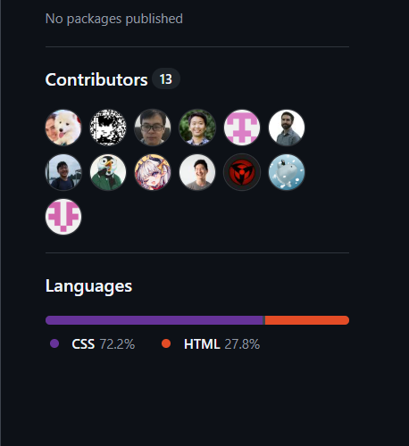

# MWRender 终极综合测试

这是一篇包含了被 MWRender 支持的 **几乎所有语法**（涵盖 CommonMark 与 GFM 扩展）的综合测试文档。

## 1. 基础块级元素 (Block Elements)

### 1.1 段落与换行
这是一个普通的段落。
这段文字与上面是同一个段落（发生了软换行）。  
这段文字通过末尾的双空格触发了硬换行（Hard Break）。

### 1.2 引用块 (Blockquotes)
> 这是一个引用块。
> > 这是一个嵌套的引用块。
> > * 引用内也可以包含列表。

### 1.3 列表 (Lists)
**无序列表：**
* 苹果 (Apple)
* 香蕉 (Banana)
  - 嵌套项 1
  - 嵌套项 2

**有序列表：**
1. 第一步
2. 第二步
3. 第三步

### 1.4 代码块 (Fenced Code Blocks)
```cpp
// 这是一个 C++ 代码块
#include <iostream>
int main() {
    std::cout << "Hello, MWRender!" << std::endl;
    return 0;
}
```

### 1.5 分隔线 (Thematic Breaks)
下面是一条分隔线：
***

## 2. 基础行内元素 (Inline Elements)

这是一些 **加粗 (Strong)** 和 *斜体 (Emphasis)* 的文本。你也可以结合使用 ***加粗斜体***。
代码可以用反引号括起来：`inline code`。在代码中甚至可以包含反引号：`` ` ``。

这里是一个 [MWRender GitHub 假链接](https://github.com/example/mwrender "MWRender Repository")。

下面是一张图片测试：

()

## 3. GFM 扩展语法 (GFM Extensions)

### 3.1 自动链接 (Autolinks)
请访问我的网站 <https://example.com> 或发送邮件至 <mailto:test@example.com>。

### 3.2 删除线 (Strikethrough)
这个特性在 GFM 中可用：~~这段文字被删除了~~。

### 3.3 任务列表 (Task Lists)
- [x] 完成解析器核心
- [x] 完成 HTML 渲染器
- [ ] 发布 1.0 正式版本

### 3.4 表格 (Tables)
| 特性         | 状态  |      备注 |
| :----------- | :---: | --------: |
| CommonMark   |   ✅   |  核心支持 |
| GFM 扩展     |   ✅   |  常用扩展 |
| 边界用例测试 |   ✅   | 100% Pass |

## 4. HTML 与 CSS 扩展 (HTML & CSS Extensions)

### 4.1 内联原生 HTML
这是通过原生 HTML 插入的 <span style="color: blue; text-decoration: underline;">蓝色下划线文字</span>。
*注：如果你在渲染时没有开启 `Trusted` 策略，上面的原生标签将被安全地转义显示为纯文本！*

### 4.2 块级原生 HTML
<details>
  <summary><b>点击展开查看隐藏内容</b></summary>
  <p>这是一个原生的 HTML details/summary 块级元素组合。如果你看到了漂亮的展开效果，说明块级 HTML 解析非常成功！</p>
</details>

### 4.3 外部 CSS 与 HTML Class 绑定
我们在文件头部的 Front Matter 引入了 `test_style.css`。下面这段文字使用了该 CSS 里面定义的 `custom-highlight` 类名（要求 HTML `Trusted` 且开启 `--allow-document-css`）：

<div class="custom-highlight">
这段文字应该会显示出定制的亮黄色背景、红色字体以及红色虚线边框！证明 Front Matter 的外部 CSS 以及原生 HTML 渲染大获成功！
</div>

### 4.4 Markdown 文件内联 CSS 与复杂 HTML 结构
除了外部 CSS，你还可以直接在 Markdown 文件中内嵌 `<style>` 标签，并编写复杂的原生 HTML 结构（比如自定义的卡片、表单或矢量图标 SVG）。

<style>
.my-custom-card {
    border: 2px solid #007bff;
    border-radius: 8px;
    padding: 20px;
    background-color: #f8f9fa;
    box-shadow: 0 4px 6px rgba(0, 0, 0, 0.1);
    margin: 20px 0;
    font-family: Arial, sans-serif;
}
.my-custom-card h4 {
    margin-top: 0;
    color: #007bff;
}
.my-custom-card button {
    background-color: #007bff;
    color: white;
    border: none;
    padding: 10px 15px;
    border-radius: 5px;
    cursor: pointer;
    transition: background-color 0.3s;
}
.my-custom-card button:hover {
    background-color: #0056b3;
}
</style>

<div class="my-custom-card">
  <h4>🚀 这是一个纯 HTML/CSS 构建的交互式卡片</h4>
  <p>它完美地混合在了 Markdown 文档中。你可以看到内联样式 `my-custom-card` 已经生效。</p>
  
  <form onsubmit="event.preventDefault(); alert('表单提交成功！在 Trusted 模式下，JS 也能运行（取决于环境）。');">
    <label for="test-input">输入测试:</label>
    <input type="text" id="test-input" placeholder="输入任意内容..." style="padding: 5px; border: 1px solid #ccc; border-radius: 4px; margin-right: 10px;">
    <button type="submit">点击提交表单</button>
  </form>
  
  <div style="margin-top: 15px;">
    <svg width="40" height="40" viewBox="0 0 100 100" xmlns="http://www.w3.org/2000/svg">
      <circle cx="50" cy="50" r="40" stroke="green" stroke-width="4" fill="yellow" />
      <text x="50" y="55" font-size="20" text-anchor="middle" fill="black">SVG</text>
    </svg>
    <span style="vertical-align: top; line-height: 40px; margin-left: 10px;">我们甚至渲染了一个原生 SVG 矢量图！</span>
  </div>
</div>


> [!NOTE]
>
> 


> [!TIP]
>
> 


> [!IMPORTANT]
>
> 


> [!WARNING]
>
> 


> [!CAUTION]
>
> 
