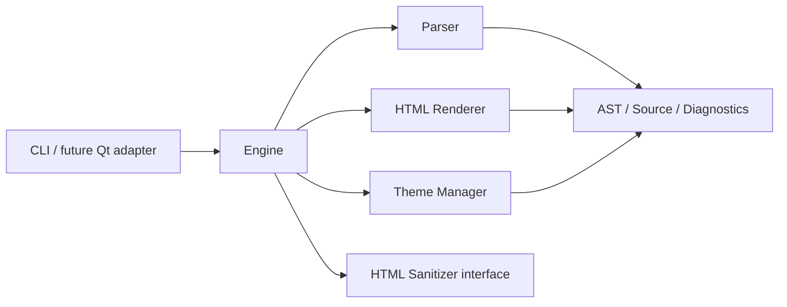

# MWRender 架构基线

## 1. 状态

本文记录开发启动时确定的架构。其约束优先级低于
[`DevelopmentGuide.md`](DevelopmentGuide.md)，但高于模块内部实现偏好。

当前阶段：MVP 可用，Phase 0-7 的核心交付已落地。

## 2. 架构目标

- 核心库不依赖 Qt、浏览器或网络。
- Parser、Renderer 不访问文件系统。
- 每次渲染的可变配置只存在于 `RenderRequest`。
- AST 是 Parser 与 Renderer 之间的唯一文档协议。
- 主题、CSS 和 sanitizer 是 Engine 管理的资源能力。
- Fragment 是基础产物，Full Document 是其包装。

## 3. 依赖方向



允许依赖：

```text
apps -> public API
Engine -> Parser, Renderer, ThemeManager, HtmlSanitizer
Parser -> AST, SourceRange, Diagnostics, EngineOptions
Renderer -> AST, RenderOptions, HtmlSanitizer
ThemeManager -> Theme model, filesystem
```

禁止依赖：

```text
Parser -> ThemeManager or filesystem
Renderer -> Parser or filesystem
ThemeManager -> Parser or Renderer
public headers -> src/ internal headers
core -> Qt
```

## 4. 目标划分

### `mwrender_core`

唯一核心库目标，对外别名为 `MWRender::Core`。包含解析、渲染、主题、安全接口和
Engine 编排。

暂不拆成多个二进制库。原因是项目仍处于 v0.x，过早拆库会增加 ABI、安装和链接
复杂度。源码目录仍按模块隔离，未来有明确复用需求时再拆目标。

### `mwrender`

薄 CLI，只处理参数、stdin/stdout、文件 I/O 和退出码。不得包含 Markdown 规则。

### `mwrender_smoke_tests`

Phase 0 使用无第三方依赖的 smoke test，验证公共头文件、目标链接和最小渲染链路。
进入 Parser 开发后再引入正式测试框架。

## 5. 公共 API 边界

公开头文件位于 `include/mwrender/`：

| 文件 | 职责 |
| --- | --- |
| `source.hpp` | UTF-8 字节位置和半开区间 |
| `diagnostics.hpp` | 稳定诊断结构 |
| `ast.hpp` | AST 节点和类型化 payload |
| `options.hpp` | Engine/Render 策略 |
| `parser.hpp` | 独立 Parser API |
| `sanitizer.hpp` | 可注入 HTML sanitizer |
| `theme.hpp` | 主题元数据与来源层级 |
| `result.hpp` | RenderRequest/RenderResult |
| `engine.hpp` | 主要门面 |
| `version.hpp` | 版本信息 |
| `mwrender.hpp` | 聚合头文件 |

`Engine` 使用 PImpl，避免内部 ThemeManager、缓存和同步机制泄漏到 ABI。

## 6. 生命周期与线程模型

```text
Engine construction
    -> register theme roots / sanitizer
    -> concurrent render calls
```

- `RenderRequest` 归调用方所有，仅在调用期间读取。
- `RenderResult` 完全拥有输出、diagnostics 和可选 AST。
- Parser/Renderer 本身无共享可变状态。
- Engine 资源注册使用内部同步。
- 渲染开始时获取 sanitizer 等资源快照，之后不持锁执行解析和渲染。
- 主题缓存加入后也必须遵守“短锁 + 不在锁内做解析/文件 I/O”原则。

## 7. 错误策略

- Markdown 语法问题优先产生 warning 并降级为文本。
- 输入限制、无效主题、严格安全策略失败产生 Error。
- 不使用异常表达普通用户输入错误。
- 文件系统异常在资源层转换为 Diagnostic。
- `RenderResult::ok` 等于 diagnostics 中不存在 Error 且管线完成。

## 8. 渲染管线

```text
RenderRequest
  -> input limits / UTF-8 policy
  -> Parser
  -> AST
  -> HtmlRenderer
  -> fragment
  -> Theme resolution
  -> CSS composition
  -> optional full-document assembly
  -> RenderResult
```

当前管线已实现基础 Markdown、GFM 扩展、HTML 策略、主题/CSS 合成、Outline 和
WordStats。后续扩展继续沿该路径增加节点与后端，不改变依赖方向。

## 9. 资源与主题

- 内置主题最终编译或嵌入到核心库，保证默认渲染不依赖当前工作目录。
- 外部主题通过 root 注册，不允许 Renderer 自行查找。
- ThemeManager 根据 `ThemeOrigin` 和注册顺序形成确定覆盖。
- 主题 JSON 解析与 CSS 读取均在 ThemeManager/CssComposer 层完成。
- Renderer 只接收最终渲染策略，不接收主题路径。

## 10. 后续演进顺序

1. 导入 CommonMark/GFM conformance 用例并记录支持矩阵。
2. 完善嵌套容器、delimiter stack 与 HTML block 边界。
3. 接入成熟的结构化 HTML sanitizer 后端。
4. 增加脚注、自定义容器和代码高亮扩展接口。
5. 增加 fuzz、benchmark 基线和跨编译器 CI。

每一步都先增加结构测试，再扩展 CLI 表面。

