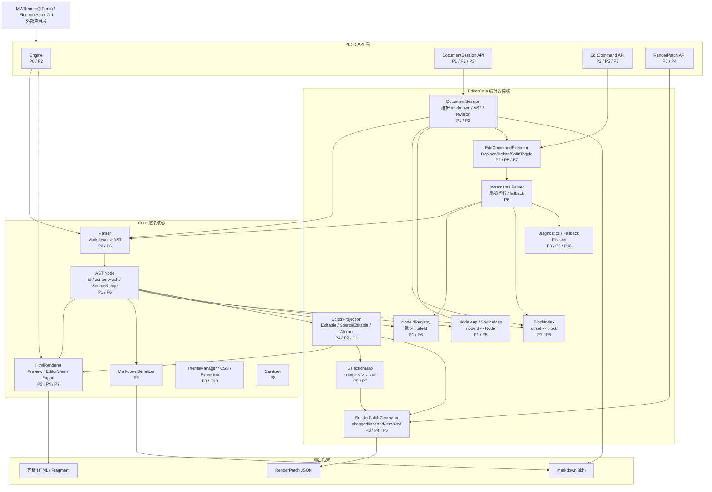
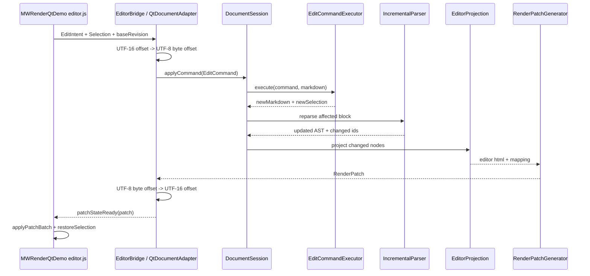

# MarkdownRenderEngine 后续开发阶段、目标与架构图

> 适用分支：`feature/expansion`  
> 目标：把 MarkdownRenderEngine 从“Markdown → HTML 渲染器”继续推进为“可支撑 MWRenderQtDemo / Typora-like / Obsidian Live Preview 的 Markdown 文档结构与编辑器内核”。

---

## 1. 当前状态判断

当前 `feature/expansion` 分支已经具备 EditorCore 的基础雏形：

```text
DocumentSession
BlockIndex
NodeIdRegistry
EditorProjection
RenderPatch
SelectionMap
EditCommand
UTF-8 / UTF-16 offset 工具
EditorCore 测试目标
```

因此，现在已经可以开始让 `MWRenderQtDemo` 接入 `DocumentSession + EditCommand + RenderPatch`，做第一版可编辑 Live Preview。

但是它还没有达到完整 Typora-like 所见即所得内核的成熟程度。现在更适合的目标是：

```text
第一阶段：Obsidian Live Preview / 当前块源码编辑
第二阶段：基础行内语法隐藏标记编辑
第三阶段：复杂块 atomic / source editor
第四阶段：更接近 Typora 的连续所见即所得体验
```

---

## 2. 总体架构图

下面是 MarkdownRenderEngine 目标架构图，并标注每个阶段主要修改的模块。



---

## 3. 编辑链路目标图

最终编辑流程应该变成：



---

# 4. 后续开发阶段

## Phase 0：整理当前 EditorCore API 与文档

### 修改的架构内容

```text
Public API 层
Core / AST / SourceRange 文档
EditorCore 文档
测试目录结构
```

### 目标

让当前 `feature/expansion` 分支的能力边界清楚，避免后续 API 越改越乱。

### 要完成的任务

1. 整理 `docs/EDITOR_CORE_DESIGN.md`。
2. 整理 `docs/RENDER_PATCH_PROTOCOL.md`。
3. 整理 `docs/SELECTION_MAPPING.md`。
4. 整理 `docs/COMMAND_EDITING.md`。
5. 明确哪些 API 是稳定接口，哪些是 experimental。
6. 明确 offset 语义：
   - 内核内部默认使用 UTF-8 byte offset；
   - UI / WebView 层使用 UTF-16 offset；
   - QtDocumentAdapter 负责转换。
7. 明确 `Node.id` 与 `Node.contentHash` 的区别。
8. 明确 `SourceRange`、`contentRange`、`markerRanges` 的区别。
9. 明确 `RenderMode::Preview`、`RenderMode::EditorView`、`RenderMode::Export` 的区别。

### 作用

这一阶段不是增加功能，而是降低后续维护成本。  
它决定了 MWRenderQtDemo 接入时是否能稳定依赖这些接口。

### 验收标准

```text
文档能解释清楚：
Markdown 是唯一真实数据
AST 是结构化表示
HTML / DOM 只是显示结果
EditCommand 如何改变 Markdown
RenderPatch 如何局部更新 UI
SelectionMap 如何恢复光标
```

---

## Phase 1：修复 EditorCore 基础稳定性问题

### 修改的架构内容

```text
DocumentSession
BlockIndex
NodeIdRegistry
AST Node id / contentHash
EditCommandExecutor
UTF-8 / UTF-16 offset 工具
```

### 目标

先保证当前已有 EditorCore 骨架不会在最基本编辑场景中产生错误 AST、重复 nodeId 或破坏中文字符。

### 要完成的任务

#### 1. 修复 `DocumentSession::applyChange` 的 fast path

当前风险是：  
`findNodeAtOffset()` 可能返回最深层 Text 节点，而局部解析得到的是 block 节点。如果用 block 替换 Text，会造成 AST 结构异常。

应改成：

```text
applyChange
  ↓
BlockIndex.blockAtOffset(change.from)
  ↓
找到受影响 block
  ↓
只替换 block 节点
```

第一版只允许这些块走 fast path：

```text
Paragraph
Heading
ThematicBreak
```

其他复杂块先 fallback full reparse。

#### 2. 修复 DeleteBackward / DeleteForward 的 UTF-8 字符边界

不能继续使用：

```cpp
markdown.erase(start - 1, 1);
markdown.erase(start, 1);
```

必须改成：

```cpp
auto from = previousUtf8Boundary(markdown, start);
auto to = nextUtf8Boundary(markdown, start);
```

保证中文、emoji、数学符号不会被删坏。

#### 3. 修复 NodeIdRegistry 可能重复分配 ID 的问题

需要增加：

```cpp
std::unordered_set<std::string> usedIds_;
```

规则：

```text
inheritIds 前收集旧 AST 所有 id
allocate 时跳过 usedIds
新分配 id 后加入 usedIds
```

#### 4. 明确 `node.id` 与 `contentHash`

建议语义：

```text
node.id          = 编辑会话内稳定 DOM 绑定 ID
node.contentHash = 判断节点内容是否变化
```

#### 5. 增加基础稳定性测试

新增或强化：

```text
document_session_test
node_id_registry_test
edit_command_test
unicode_test
```

重点测试：

```text
修改段落后 AST 不嵌套错误
新增段落后 nodeId 不重复
中文 Backspace 不破坏 UTF-8
emoji Delete 不破坏 UTF-8
```

### 作用

这是 MWRenderQtDemo 能否安全接入的前提。  
如果这一阶段不稳，Demo 会出现：

```text
光标跳走
DOM patch 找错节点
中文删除乱码
重复 data-node-id
AST 结构异常
```

### 验收标准

```text
普通段落输入、删除、回车不会破坏 AST
中文和 emoji 删除正常
nodeId 不重复
修改一个段落不会让其他段落 id 大量变化
```

---

## Phase 2：完善 DocumentSession 与 EditCommand 第一版可编辑能力

### 修改的架构内容

```text
DocumentSession
EditCommandExecutor
EditCommand API
Markdown 源码维护
Selection 结构
```

### 目标

让 MarkdownRenderEngine 可以作为 MWRenderQtDemo 第一版编辑后端使用。

### 要完成的任务

#### 1. 完善 DocumentSession

DocumentSession 应稳定支持：

```cpp
void load(std::string markdown);
const std::string& markdown() const;
const Node& document() const;
std::size_t revision() const;

UpdateResult applyChange(const TextChange& change);
UpdateResult applyCommand(const EditCommand& command);

const Node* findNodeById(std::string_view nodeId) const;
const Node* findNodeAtOffset(std::size_t sourceOffset) const;
```

#### 2. 完善第一批 EditCommand

必须稳定支持：

```text
ReplaceSelection
DeleteBackward
DeleteForward
SplitBlock
MergeBlock
```

这五个命令是可编辑 Demo 的最低要求。

#### 3. 第二批基础结构命令

继续完善：

```text
ToggleStrong
ToggleEmphasis
ToggleInlineCode
ToggleTask
SetHeadingLevel
```

#### 4. Selection 返回规则

每次命令执行后都应该返回新的 selection：

```text
输入文本后，光标移动到插入文本末尾
删除后，光标停在删除位置
回车后，光标进入新段落
ToggleStrong 后，光标保留或进入加粗内容
```

#### 5. 失败回退机制

EditCommand 执行失败时需要返回：

```text
ok = false
diagnostics
fallbackFullReparse reason
```

### 作用

这一阶段让 MWRenderQtDemo 可以不用自己修改 Markdown 字符串，而是把用户操作转成 EditCommand 交给 MarkdownRenderEngine。

### 验收标准

```text
输入普通文字成功
删除文字成功
Enter 拆分段落成功
Backspace 在段首能合并段落
Ctrl+B 能生成或取消 strong
任务列表 checkbox 能切换 [ ] / [x]
每次操作 revision 正确递增
每次操作能返回新 selection
```

---

## Phase 3：稳定 RenderPatch 协议

### 修改的架构内容

```text
RenderPatch
RenderPatchGenerator
HtmlRenderer EditorView 输出
Diagnostics
Public Patch API
```

### 目标

让 UI 不再依赖整篇 HTML，而是只根据 patch 局部更新 DOM。

### 要完成的任务

#### 1. 扩展 RenderPatch 数据结构

建议结构：

```cpp
struct NodeHtmlPatch {
    std::string nodeId;
    std::string html;
    ProjectionMode mode;
    SourceRange sourceRange;
    SourceRange contentRange;
    std::string parentId;
    std::size_t insertIndex = 0;
};

struct RenderPatch {
    std::size_t revision = 0;
    bool fullReload = false;
    std::vector<std::string> removedNodeIds;
    std::vector<NodeHtmlPatch> changedNodes;
    std::vector<NodeHtmlPatch> insertedNodes;
    std::optional<Selection> selection;
    std::vector<Diagnostic> diagnostics;
};
```

#### 2. 增加 fullReload / diagnostics

用于告诉 UI：

```text
这次是局部 patch
还是必须整篇刷新
为什么 fallback
```

#### 3. 统一 JSON 协议

对 MWRenderQtDemo 输出应稳定为：

```json
{
  "revision": 12,
  "fullReload": false,
  "removedNodeIds": [],
  "changedNodes": [],
  "insertedNodes": [],
  "selection": {},
  "diagnostics": []
}
```

#### 4. patch 节点必须携带 UI 需要字段

每个 changed / inserted node 至少包括：

```text
nodeId
html
mode
sourceStart
sourceEnd
contentStart
contentEnd
parentId
insertIndex
```

#### 5. stale patch 处理规则

UI 必须能按 revision 忽略旧 patch：

```js
if (patch.revision < currentRevision) return;
```

### 作用

这是性能的关键阶段。  
只有 patch 稳定，MWRenderQtDemo 才能做到：

```text
输入一个字只更新当前 block
不 applyFullState
不 replaceChildren 整篇文档
不全文跑 MathJax / Mermaid / Highlight
```

### 验收标准

```text
修改段落只返回一个 changedNode
新增段落返回 insertedNode
删除段落返回 removedNodeId
patch 带 revision
patch 带 selection
patch 带 source range
普通输入不需要 fullReload
```

---

## Phase 4：完善 EditorProjection 与 EditorView HTML

### 修改的架构内容

```text
EditorProjection
HtmlRenderer::EditorView
AST SourceRange / contentRange / markerRanges
ProjectionMode
```

### 目标

让引擎能够输出适合编辑器使用的 HTML，而不是只输出普通预览 HTML。

### 要完成的任务

#### 1. 统一 HTML 属性协议

建议统一输出：

```html
<p
  data-node-id="n1"
  data-projection-mode="editable"
  data-source-start="0"
  data-source-end="12"
  data-content-start="0"
  data-content-end="12"
  data-node-type="paragraph">
</p>
```

不要让 Demo 侧同时兼容太多属性名。

#### 2. 明确 ProjectionMode

```cpp
enum class ProjectionMode {
    Editable,
    SourceEditable,
    Atomic,
    Hidden,
    Unsupported
};
```

第一阶段分类：

```text
Paragraph     -> Editable
Heading       -> Editable
Text          -> Editable
SoftBreak     -> Editable
HardBreak     -> Editable

Strong        -> SourceEditable
Emphasis      -> SourceEditable
InlineCode    -> SourceEditable
Link          -> SourceEditable
Image         -> SourceEditable
TaskList      -> SourceEditable / Editable checkbox

CodeBlock     -> Atomic
MathBlock     -> Atomic
Mermaid       -> Atomic
Table         -> Atomic
HtmlBlock     -> Atomic
FootnoteDef   -> Atomic
```

#### 3. 当前块源码编辑支持

EditorProjection 应能为每个 block 提供：

```text
renderedHtml
sourceText
sourceStart
sourceEnd
mode
```

让 UI 可以：

```text
未聚焦：显示 renderedHtml
聚焦：显示 sourceText
失焦：重新渲染该 block
```

#### 4. 输出 block 级稳定边界

每个 block 必须能明确：

```text
sourceStart
sourceEnd
contentStart
contentEnd
nodeId
```

### 作用

这一阶段让 MWRenderQtDemo 可以先实现最稳的 Live Preview：

```text
当前块编辑源码
其他块渲染显示
复杂块 atomic
```

这是完整 Typora-like 前的必要台阶。

### 验收标准

```text
Paragraph / Heading 输出 data-projection-mode="editable"
CodeBlock / MathBlock / Mermaid 输出 data-projection-mode="atomic"
每个 block 有 sourceStart/sourceEnd
当前块可以切换 source edit
失焦后可以重新渲染当前块
```

---

## Phase 5：完善 SelectionMap 与 UTF-16 / UTF-8 映射

### 修改的架构内容

```text
SelectionMap
SourceMap
ProjectionSegment
UTF-8 / UTF-16 工具
QtDocumentAdapter 协议
```

### 目标

解决编辑器最难的问题：光标位置在源码与 DOM 之间的稳定映射。

### 要完成的任务

#### 1. 明确三种 offset

```text
UTF-8 byte offset：MarkdownRenderEngine 内部使用
UTF-16 code unit offset：浏览器 DOM / JS 使用
visual offset：编辑器投影视图里的可见字符位置
```

#### 2. QtDocumentAdapter 转换规则

MWRenderQtDemo 传入：

```text
JS UTF-16 offset
```

进入内核前转换为：

```text
UTF-8 byte offset
```

RenderPatch 返回前再转换回：

```text
JS UTF-16 offset
```

#### 3. 完善 Selection 结构

建议：

```cpp
struct SourcePosition {
    std::size_t offset = 0;
    Affinity affinity = Affinity::After;
    std::string contextNodeId;
};

struct Selection {
    SourcePosition anchor;
    SourcePosition focus;
};
```

#### 4. 增加 ProjectionSegment

为后续 hidden marker 做准备：

```cpp
struct ProjectionSegment {
    std::string projectionId;
    std::string nodeId;
    SourceRange sourceRange;
    ProjectionSegmentKind kind;
    std::string text;
};
```

#### 5. 支持 hidden marker 映射

必须逐步支持：

```text
# 标题
**bold**
*em*
`code`
[text](url)
- [ ] task
```

#### 6. 强化中文与 emoji 测试

测试必须覆盖：

```text
中文输入
中文删除
emoji 输入
emoji 删除
中英文混合
surrogate pair
组合字符
```

### 作用

这一阶段决定编辑体验是否稳定。  
如果 SelectionMap 不稳，就会出现：

```text
光标跳动
中文输入中断
删除错字符
加粗位置错误
patch 后光标丢失
```

### 验收标准

```text
英文输入光标稳定
中文输入光标稳定
emoji 删除不乱码
patch 后 selection 可恢复
Heading 隐藏 # 后映射正确
Strong 隐藏 ** 后映射正确
Link 显示文本时映射正确
```

---

## Phase 6：真正的块级增量解析

### 修改的架构内容

```text
IncrementalParser
BlockIndex
DocumentSession
NodeIdRegistry
RenderPatchGenerator
Diagnostics
```

### 目标

让普通编辑不再默认全文解析，而是只解析受影响 block。

### 要完成的任务

#### 1. BlockIndex 定位受影响范围

```text
TextChange
  ↓
BlockIndex.blockAtOffset
  ↓
affectedRange
```

#### 2. 第一批支持局部解析的块

```text
Paragraph
Heading
ThematicBreak
Fenced CodeBlock
MathBlock
```

#### 3. 复杂结构先 fallback

这些先不强求局部解析：

```text
List
BlockQuote
Table
HtmlBlock
FootnoteDef
LinkReferenceDef
```

但必须记录：

```text
fullReparse = true
reason = "list incremental parsing not supported yet"
```

#### 4. NodeId 继承

局部解析后必须保证：

```text
未修改节点 ID 保持
修改节点尽量保持原 ID
新增节点分配新 ID
删除节点进入 removedNodeIds
```

#### 5. changed / inserted / removed 计算

UpdateResult 应稳定返回：

```text
changedNodeIds
insertedNodeIds
removedNodeIds
affectedRange
fullReparse
partialReparse
diagnostics
```

### 作用

这是大文档性能的核心。  
没有块级增量解析，1MB 文档每输入一个字都可能卡顿。

### 验收标准

```text
修改普通段落不 fullReparse
修改标题不 fullReparse
修改代码块内部只影响代码块
修改数学块内部只影响数学块
修改表格允许 fullReparse，但必须记录 reason
1MB 文档修改一个段落明显快于全文解析
```

---

## Phase 7：基础 Live Preview 行内语法

### 修改的架构内容

```text
EditorProjection
SelectionMap
EditCommandExecutor
RenderPatchGenerator
HtmlRenderer::EditorView
```

### 目标

在当前块源码编辑稳定后，逐步支持更接近 Obsidian Live Preview 的体验。

### 要完成的任务

#### 1. Paragraph / Heading 直接编辑

普通段落和标题可以直接编辑内容，不显示完整源码。

#### 2. Strong / Emphasis hidden marker

支持：

```markdown
**bold**
*em*
```

显示时隐藏 marker，但源码仍保持 Markdown。

#### 3. InlineCode hidden marker

支持：

```markdown
`code`
```

显示 code 内容，隐藏反引号。

#### 4. Link 显示文本

支持：

```markdown
[text](url)
```

默认显示 text，必要时进入源码编辑。

#### 5. TaskList checkbox

支持：

```markdown
- [ ] task
- [x] task
```

checkbox 可点击，点击后通过 `ToggleTask` 修改 Markdown。

#### 6. 对应 selection 映射

所有 hidden marker 必须能正确映射 source offset 和 visual offset。

### 作用

这一阶段让编辑体验从“当前块源码编辑”升级到“基础 Live Preview”。

### 验收标准

```text
普通段落输入像富文本
标题输入像富文本
加粗内容可编辑
斜体内容可编辑
inline code 可编辑
链接文本可编辑
任务列表 checkbox 可点击
保存结果仍然是正确 Markdown
```

---

## Phase 8：复杂块 Atomic 与 Source Editor

### 修改的架构内容

```text
EditorProjection
HtmlRenderer
Extension Renderers
Sanitizer
ThemeManager
RenderPatchGenerator
```

### 目标

复杂 Markdown 语法先不直接做富文本编辑，而是 atomic 显示，必要时进入源码编辑。

### 要完成的任务

#### 1. Atomic 块类型

第一批 atomic：

```text
CodeBlock
MathBlock
Mermaid
Table
HtmlBlock
FootnoteDef
```

#### 2. Atomic HTML 输出

每个 atomic block 必须带：

```text
data-node-id
data-projection-mode="atomic"
data-source-start
data-source-end
data-node-type
```

#### 3. 双击进入源码编辑

UI 可以根据 source range 拉取源码：

```text
sourceText = markdown[sourceStart:sourceEnd]
```

编辑完成后通过 ReplaceSelection 回写。

#### 4. 按需渲染复杂块

为 Demo 提供标记，支持：

```text
MathJax 只渲染可见块
Mermaid 只渲染可见块
Highlight 只处理可见代码块
```

#### 5. 缓存支持

Mermaid / Math / Highlight 应支持缓存 key：

```text
nodeId + contentHash
```

### 作用

这一阶段保证复杂语法不会破坏文档，同时不会拖慢普通输入。

### 验收标准

```text
代码块 atomic 显示
数学公式 atomic 显示
Mermaid atomic 显示
表格 atomic 显示
双击可源码编辑
编辑后保存 Markdown 正确
复杂块不会在普通输入时全文重渲染
```

---

## Phase 9：MarkdownSerializer 风格保留

### 修改的架构内容

```text
MarkdownSerializer
AST payload
Parser marker recording
DocumentSession markdown preservation
EditCommandExecutor
```

### 目标

编辑后保存 Markdown 时，不要无意义改变用户原始风格。

### 要完成的任务

#### 1. 保留列表 marker

```markdown
* item
+ item
- item
```

修改后应保持原 marker。

#### 2. 保留 strong / emphasis marker

```markdown
__bold__
**bold**
_em_
*em*
```

不要随意统一成一种格式。

#### 3. 保留代码围栏风格

```markdown
```cpp
code
```

~~~~
code
~~~~
```

应尽量保持原样。

#### 4. 保留换行风格

```text
LF
CRLF
```

#### 5. 保留空行与列表编号

```text
空行数量
ordered list 起始编号
task marker 大小写
```

#### 6. 扩展 MarkdownStyle

建议：

```cpp
struct MarkdownStyle {
    std::string bulletMarker = "-";
    std::string strongMarker = "**";
    std::string emphasisMarker = "*";
    std::string codeFenceMarker = "```";
    std::string lineEnding = "\n";

    bool preserveOriginalMarkers = true;
    bool preserveBlankLines = true;
    bool preserveListStartNumber = true;
    bool preserveTaskMarkerCase = true;
};
```

### 作用

这一阶段决定编辑器是否“尊重用户原文”。  
如果 Serializer 不保留风格，用户保存一次文件就会出现大量无意义 diff。

### 验收标准

```text
* item 不自动变成 - item
__bold__ 不自动变成 **bold**
CRLF 文档保存后仍是 CRLF
修改一个段落不会格式化整篇文档
列表编号不乱变
空行数量不乱变
```

---

## Phase 10：性能、Benchmark 与稳定性收尾

### 修改的架构内容

```text
Benchmark
DocumentSession
IncrementalParser
RenderPatchGenerator
HtmlRenderer
Extension Renderers
Diagnostics
```

### 目标

让 MarkdownRenderEngine 可以支撑中大型文档编辑。

### 要完成的任务

#### 1. 新增 editor benchmark

测试场景：

```text
1000 段普通段落
5000 个标题
100 个代码块
100 个数学块
100 个 Mermaid
100 个表格
1MB 混合文档
随机修改 100 次
```

#### 2. 性能指标

目标：

```text
1MB 文档首次解析 < 1000ms
1MB 文档首屏可显示 < 200ms
普通段落输入一个字 < 16ms
普通段落 patch 生成 < 8ms
selection 映射 < 4ms
普通段落编辑不 fullReparse
```

#### 3. fallback 统计

每次 fallback 应记录：

```text
fallback type
reason
affected node
elapsed time
```

#### 4. 大文档稳定性

测试：

```text
随机插入
随机删除
随机回车
随机加粗
随机任务列表切换
随机撤销重做
```

#### 5. 内存与 nodeId 稳定性

测试：

```text
多次编辑后无重复 nodeId
nodeMap 不持有悬空指针
旧 AST 替换后无 dangling pointer
```

### 作用

这一阶段让项目从“功能能跑”进入“可长期使用”。

### 验收标准

```text
1MB 文档可编辑
普通输入不明显卡顿
fallback 有清晰原因
nodeId 长时间编辑不重复
随机编辑测试不崩溃
Benchmark 可在 CI 或本地稳定运行
```

---

# 5. 阶段与架构修改对应表

| 阶段 | 主要目标 | 修改的架构模块 | 对 MWRenderQtDemo 的意义 |
|---|---|---|---|
| Phase 0 | API 与文档整理 | Public API、docs、测试结构 | Demo 接入时知道哪些接口能用 |
| Phase 1 | 基础稳定性修复 | DocumentSession、BlockIndex、NodeIdRegistry、EditCommand | 防止 AST 错乱、nodeId 重复、中文删除乱码 |
| Phase 2 | 第一版编辑命令 | DocumentSession、EditCommandExecutor、Selection | Demo 可以输入、删除、回车、保存 |
| Phase 3 | RenderPatch 协议 | RenderPatch、RenderPatchGenerator、Diagnostics | Demo 可以局部更新 DOM |
| Phase 4 | EditorView HTML | EditorProjection、HtmlRenderer | Demo 可以当前块源码编辑 |
| Phase 5 | 光标映射 | SelectionMap、SourceMap、UTF 转换 | Demo 光标不跳、中文输入更稳 |
| Phase 6 | 块级增量解析 | IncrementalParser、BlockIndex、NodeIdRegistry | 大文档输入不卡 |
| Phase 7 | 基础 Live Preview | EditorProjection、SelectionMap、EditCommand | 支持加粗、斜体、链接、任务列表体验 |
| Phase 8 | 复杂块处理 | Atomic Projection、Extension Renderer | 数学公式、Mermaid、表格不破坏文档 |
| Phase 9 | 风格保留 | MarkdownSerializer、AST payload | 保存不产生大量无意义 diff |
| Phase 10 | 性能与稳定性 | Benchmark、Diagnostics、全链路 | 项目进入可长期使用状态 |

---

# 6. 推荐开发顺序

## 第一轮：让 Demo 能安全接入

```text
1. Phase 1：修 applyChange fast path
2. Phase 1：修 UTF-8 删除
3. Phase 1：修 NodeIdRegistry 防重复
4. Phase 2：稳定 Replace/Delete/Split/Merge
5. Phase 3：稳定 RenderPatch JSON
6. Phase 4：统一 data-projection-mode / source range
```

完成后，MWRenderQtDemo 可以开始：

```text
当前块源码编辑
普通段落输入
标题输入
Backspace / Delete
Enter
Ctrl+S 保存
patchStateReady 局部更新
```

---

## 第二轮：让 Live Preview 体验变好

```text
1. Phase 5：SelectionMap 与 UTF offset
2. Phase 7：Strong / Emphasis / InlineCode
3. Phase 7：Link 文本显示
4. Phase 7：TaskList checkbox
5. Phase 8：复杂块 atomic/source editor
```

完成后，Demo 接近 Obsidian Live Preview。

---

## 第三轮：让项目接近产品级

```text
1. Phase 6：块级增量解析
2. Phase 9：Markdown 风格保留
3. Phase 10：性能 benchmark
4. Phase 10：随机编辑稳定性测试
```

完成后，MarkdownRenderEngine 才真正接近 Typora-like 编辑器内核。

---

# 7. 当前最小可用目标

如果只想最快让 MarkdownRenderEngine 支撑 MWRenderQtDemo 编辑，最低目标是：

```text
1. DocumentSession 稳定维护 Markdown 源码
2. EditCommand 支持 ReplaceSelection / Delete / SplitBlock
3. RenderPatch 返回 changedNodes / insertedNodes / removedNodeIds
4. EditorView HTML 输出 data-node-id / data-source-start / data-source-end
5. UTF-8 / UTF-16 offset 转换正确
6. NodeId 不重复
7. 普通段落编辑不 fullReload
```

达到这个目标后，就可以认为：

```text
MarkdownRenderEngine 已经可以支撑 MWRenderQtDemo 的第一版可编辑 Live Preview。
```

但还不能认为：

```text
已经完成完整 Typora-like 所见即所得内核。
```

完整 Typora-like 需要继续完成：

```text
SelectionMap
HiddenMarker
复杂行内语法投影
复杂块 atomic/source editor
块级增量解析
Markdown 风格保留
性能 benchmark
```

---

# 8. 最终目标

MarkdownRenderEngine 最终应该成为：

```text
一个纯 C++ Markdown 文档结构与编辑器内核。
```

它不仅能做：

```text
Markdown -> HTML
```

还要能做：

```text
Markdown -> AST
AST -> EditorProjection
用户输入 -> EditCommand
EditCommand -> Markdown 修改
Markdown 修改 -> 局部 AST 更新
局部 AST 更新 -> RenderPatch
source offset <-> visual offset
AST / Markdown -> 保留风格的 Markdown 保存
```

最终架构职责应该稳定为：

```text
MarkdownRenderEngine:
  文档结构
  解析
  编辑命令
  局部更新
  光标映射
  patch 生成
  Markdown 保存

MWRenderQtDemo:
  Qt UI
  WebView
  QWebChannel
  文件读写
  DOM patch
  用户交互
```

一句话总结：

> MarkdownRenderEngine 后续不是继续单纯堆 Markdown 渲染功能，而是要把 EditorCore 做稳，让它成为 MWRenderQtDemo 以及未来 Electron / Qt Markdown 编辑器可以复用的底层文档引擎。
