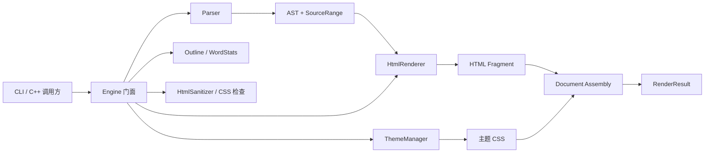
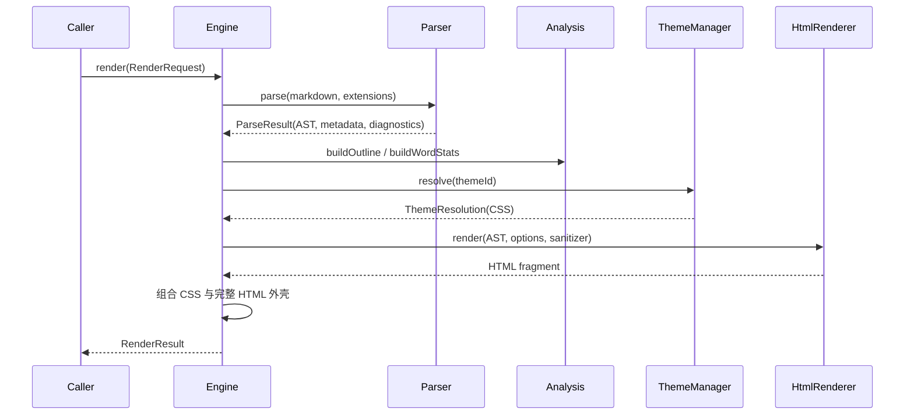

# MWRender 架构与源码阅读指南

本文面向第一次阅读 MWRender 源码的开发者，回答三个问题：

1. 项目由哪些模块组成，它们如何协作？
2. 应该按照什么顺序阅读源码？
3. 看懂和修改项目需要掌握哪些知识？

建议先跑通程序，再沿一条真实调用链阅读。不要从约 1700 行的
`parser.cpp` 第一行开始硬啃。

## 1. 项目定位

MWRender 是一个使用 C++20 编写的 Markdown 文档引擎，核心转换过程是：

```text
Markdown 源文本 -> AST -> HTML Fragment -> 完整 HTML 文档
```

除基础渲染外，它还提供：

- Markdown 扩展：表格、任务列表、删除线、脚注、数学公式、Mermaid 等；
- 源码位置：每个 AST 节点记录原文范围和 Markdown 标记范围；
- 编辑器能力：节点查询、SourceMap、增量更新、结构化编辑命令；
- 输出能力：AST 重新序列化为 Markdown、主题与 CSS 组合；
- 安全能力：HTML 策略、URL 检查、CSS 资源检查；
- 工程能力：CLI、快照测试、一致性测试、压力与安全测试。

核心库没有外部运行时依赖，也不依赖 Qt 或浏览器。

## 2. 总体架构



最重要的边界是：

- `Parser` 只理解 Markdown，不读取主题和文件；
- AST 是解析器与渲染器之间的文档协议；
- `HtmlRenderer` 只把 AST 转成 HTML，不负责寻找主题；
- `ThemeManager` 负责主题发现与解析，不理解 Markdown；
- `Engine` 负责组合各模块，是调用方通常使用的入口；
- CLI 只处理参数和文件 I/O，不应包含 Markdown 语法规则。

## 3. 目录地图

| 路径 | 职责 | 阅读优先级 |
| --- | --- | --- |
| `include/mwrender/` | 稳定的公共 API 和核心数据类型 | 最高 |
| `src/engine.cpp` | 完整管线编排、编辑命令、增量更新 | 最高 |
| `src/parser/parser.cpp` | Markdown 块级和行内解析 | 高 |
| `src/render/html_renderer.cpp` | AST 到 HTML 的转换 | 高 |
| `src/serializer/serializer.cpp` | AST 到 Markdown 的反向转换 | 中 |
| `src/query/` | 节点查询和源码/视觉位置映射 | 中 |
| `src/analysis/` | 大纲与字数统计 | 中 |
| `src/theme/` | 内置/外部主题解析与选择 | 中 |
| `src/sanitizer.cpp` | HTML allowlist 清理 | 中 |
| `src/support/` | JSON、纯文本提取、slug 等内部工具 | 较低 |
| `apps/mwrender/main.cpp` | CLI 参数、配置、输入输出 | 入门可读 |
| `tests/` | 行为示例和回归约束 | 最高 |
| `tools/embed.cpp` | 构建期资源嵌入工具 | 较低 |
| `resources/`、`themes/` | 被嵌入或加载的 CSS/JS/主题资源 | 按需 |

构建时，`tools/embed.cpp` 把 CSS/JS 转成生成头文件，输出到
`build/clangd/generated/mwrender/`。这些生成文件不是核心阅读对象。

## 4. 核心数据模型

### 4.1 SourceRange

先读 `include/mwrender/source.hpp`。

`SourcePosition` 同时保存 UTF-8 字节偏移、行号和列号；`SourceRange` 使用左闭右开
区间 `[begin, end)`。字节偏移是精确定位的基准。

理解它很重要，因为解析、诊断、编辑命令、节点查询和 SourceMap 都依赖它。

### 4.2 AST

再读 `include/mwrender/ast.hpp`。

AST 使用一棵拥有所有权的树：

```text
Node
├── id                 稳定节点标识
├── type               NodeType
├── range              节点在原文中的完整范围
├── contentRange       内容范围
├── markerRanges       Markdown 标记范围
├── payload            节点类型专属数据
├── literal            原始或规范化文本
└── children           vector<unique_ptr<Node>>
```

这里没有为每种节点建立子类，而是使用：

- `NodeType` 表示节点种类；
- `std::variant` 类型的 `NodePayload` 保存专属字段；
- `std::unique_ptr<Node>` 表达树的唯一所有权。

例如标题等级存入 `HeadingData`，链接地址存入 `LinkData`。

### 4.3 请求与结果

阅读 `options.hpp`、`parser.hpp`、`result.hpp`：

```text
RenderRequest
├── markdown
├── sourcePath
├── RenderOptions
└── CssRequest

RenderResult
├── ok
├── html / fragment / css
├── document (AST)
├── diagnostics
├── resolvedThemeId
├── outline
└── stats
```

配置按层次划分：

- `EngineOptions`：输入大小、嵌套深度、非法 UTF-8 策略；
- `ParseOptions`：Markdown 扩展开关；
- `RenderOptions`：输出模式、HTML 策略、主题、SourceMap 等。

## 5. 一次 render() 的调用链

以 `Engine::render()` 为主线阅读 `src/engine.cpp`：



管线中的关键细节：

1. 解析失败或产生 Error 时提前返回；
2. Front Matter 可以影响标题、主题和 CSS；
3. Engine 在渲染开始时复制主题配置并获取 sanitizer 快照；
4. Renderer 先预扫描标题和脚注，再渲染节点；
5. Fragment 是基础产物，`FullDocument` 只是在其外层组装 HTML5 文档；
6. 最终结果同时携带 HTML、AST、诊断、大纲和统计信息。

## 6. Parser 内部结构

`src/parser/parser.cpp` 是项目中最复杂的文件，建议分段阅读。

### 6.1 输入预处理

先找这些函数：

- `scanLines()`：把输入拆成带源位置的行；
- UTF-8 校验/替换相关函数：执行 `InvalidUtf8Policy`；
- `makeRange()`、`remapSourceRanges()`：建立和修正源码范围；
- `generateStableId()`：根据节点信息生成稳定 ID。

### 6.2 行内解析

接着阅读 `parseInline()`。它按字符扫描文本，识别：

- 普通文本与转义；
- emphasis/strong/strikethrough；
- 行内代码；
- 链接、图片、自动链接；
- HTML、数学公式、脚注引用；
- 软换行和硬换行。

第一次阅读只选择 `Text -> Strong -> Link` 三条分支，弄清如何创建节点、设置范围并
递归解析子节点。其余分支以后类推。

### 6.3 块级解析

然后从 `makeDocument()` 阅读主循环，并跟踪：

- `matchHeading()`：标题；
- `matchFence()` / `isClosingFence()`：围栏代码块；
- `matchListMarker()`：列表；
- 表格分隔行相关函数：GFM 表格；
- `makeParagraph()`：段落及其行内解析；
- blockquote、HTML block、脚注定义和 Front Matter 分支。

块级解析决定“哪些行组成一个块”，行内解析决定“块的文本内部是什么”。这是理解
整个 Parser 的关键分层。

## 7. Renderer 内部结构

阅读 `src/render/html_renderer.cpp` 时按以下顺序：

1. `escapeHtmlText()` 与 `escapeHtmlAttribute()`：输出编码；
2. `isSafeUrl()`：链接协议安全；
3. `RendererState`：一次渲染的临时状态；
4. 预扫描逻辑：收集标题 slug、TOC、脚注定义和引用；
5. 节点类型分派：根据 `NodeType` 输出对应标签；
6. `HtmlRenderer::render()`：生成 Fragment；
7. `assembleDocument()`：组合完整 HTML 文档。

Renderer 是理解 AST 的最佳位置：每个节点最终应该产生什么 HTML，在这里非常直观。

## 8. 推荐源码阅读顺序

### 阶段一：先看到完整产品行为

1. `README.md`
2. `examples/api_example.cpp`
3. `apps/mwrender/main.cpp`
4. `tests/smoke_test.cpp`

目标：知道库如何被使用，并能回答 `RenderRequest` 如何变成 `RenderResult`。

### 阶段二：建立数据模型

1. `include/mwrender/source.hpp`
2. `include/mwrender/diagnostics.hpp`
3. `include/mwrender/ast.hpp`
4. `include/mwrender/options.hpp`
5. `include/mwrender/parser.hpp`
6. `include/mwrender/result.hpp`
7. `include/mwrender/engine.hpp`

目标：不看实现，也能画出主要类型及所有权关系。

### 阶段三：跟踪最小渲染链路

1. `Engine::render()`
2. `Parser::parse()`
3. `makeDocument()` 中标题和段落分支
4. `parseInline()` 中 Text 和 Strong 分支
5. `HtmlRenderer::render()`
6. Renderer 中 Document、Heading、Paragraph、Text、Strong 分支
7. `assembleDocument()`

目标：完整跟踪输入 `# Hello **world**` 如何生成 AST 和 HTML。

### 阶段四：补齐横向能力

1. `src/analysis/document_analysis.cpp`
2. `src/support/document_text.cpp`
3. `src/query/query.cpp`
4. `src/query/source_map.cpp`
5. `src/serializer/serializer.cpp`
6. `Engine::renderNode()`、`update()`、`applyCommand()`

目标：理解项目为何不仅是 Markdown 转 HTML，也能支持编辑器。

注意：当前 `update()` 仍采用“重新解析全文 + 按稳定 ID 比较”的实现，并非局部增量
语法分析。

### 阶段五：主题与安全

1. `src/theme/theme_manager.cpp`
2. `src/support/json.cpp`
3. `src/sanitizer.cpp`
4. `Engine::render()` 中 CSS 合成与安全检查部分
5. `tests/security_test.cpp`

目标：理解不可信 Markdown、HTML、URL、CSS 和文件路径分别在哪一层被约束。

### 阶段六：用测试理解边界

| 测试 | 重点 |
| --- | --- |
| `smoke_test.cpp` | 主流程与常用特性 |
| `edge_test.cpp` | UTF-8、SourceRange、slug、边界行为 |
| `conformance_test.cpp` | Markdown/GFM 兼容性 |
| `snapshot_test.cpp` | HTML 输出稳定性 |
| `new_features_test.cpp` | 编辑器和新增能力 |
| `security_test.cpp` | HTML、URL、CSS、路径安全 |
| `stress_test.cpp` | 大输入、深嵌套、病态输入 |
| `benchmark.cpp` | 性能基线 |

目标：修改任何功能前，知道应该把回归测试放在哪里。

## 9. 需要掌握的知识点

### 9.1 必备 C++ 知识

- C++20 基础语法、类、枚举、命名空间；
- RAII 与对象生命周期；
- `std::unique_ptr`、`std::shared_ptr`、移动语义；
- `std::string` 与非拥有型 `std::string_view`；
- `std::vector`、`std::optional`、`std::variant`、`std::filesystem`；
- lambda、递归遍历、标准算法；
- `const` 正确性和 `[[nodiscard]]`；
- PImpl 模式；
- `std::mutex`、`std::scoped_lock` 和资源快照的线程安全思路。

最容易踩坑的是 `string_view` 生命周期和 `unique_ptr` 导致的不可复制语义。

### 9.2 编译与工程知识

- CMake target、`PUBLIC`/`PRIVATE` include 传播；
- CMake Presets 和 `compile_commands.json`；
- 静态库、可执行文件和 target linking；
- 自定义构建命令与生成头文件；
- MinGW/GCC 的编译、链接和调试基本流程；
- CTest、快照测试和回归测试。

### 9.3 解析器知识

- 词法扫描与递归下降的基本概念；
- 块级语法与行内语法的两层处理；
- AST/CST、节点范围、半开区间；
- delimiter、嵌套、回退为普通文本；
- 错误恢复：Markdown 语法异常通常降级为文本，而非终止解析；
- 稳定节点 ID 对编辑器增量更新的价值。

不要求先学编译原理全套。能理解“扫描输入、匹配规则、构造树、错误恢复”就可以开始。

### 9.4 Markdown 与 Web 知识

- CommonMark 的块级和行内规则；
- GFM 表格、任务列表、删除线、自动链接；
- HTML 文本与属性转义；
- URL scheme 安全；
- HTML allowlist sanitizer；
- CSS `@import`、`url()` 和 `</style>` 注入风险；
- HTML fragment 与完整 HTML document 的区别。

### 9.5 编辑器相关知识

- 源码偏移、行列号与 UTF-8 字节位置；
- 光标/选区到 AST 节点的映射；
- 可见内容与 Markdown marker 的区别；
- 树 diff、稳定 ID、结构化编辑命令；
- 序列化和 round-trip 的含义。

这部分只在研究 `query`、`source_map`、`update` 和 `applyCommand` 时需要。

## 10. 建议的实际阅读方法

### 10.1 使用一个最小输入

准备如下 Markdown：

```markdown
# Hello

This is **MWRender**.
```

在以下位置设置断点：

1. `Engine::render()`；
2. `Parser::parse()`；
3. `makeDocument()`；
4. `parseInline()`；
5. `HtmlRenderer::render()`；
6. Renderer 的 Heading 和 Strong 分支；
7. `assembleDocument()`。

每到一处观察 `Node::type`、`range`、`literal`、`payload` 和 `children`。

### 10.2 每阶段做一个小修改

- Parser：增加一个简单语法或修复一个边界用例；
- Renderer：为一个现有节点增加确定性的 CSS class；
- Serializer：确认修改后的 AST 能重新输出 Markdown；
- Query：用 offset 找到光标所在节点；
- Security：添加一个危险 URL/CSS 输入并验证诊断；
- Test：先写失败测试，再修改实现。

小改动比连续阅读几千行代码更容易建立真实理解。

### 10.3 始终带着四个问题

阅读任何功能时都问：

1. 输入数据从哪里来？
2. 数据的所有权属于谁？
3. 错误通过返回值、诊断还是异常表达？
4. SourceRange 和稳定 ID 是否仍然正确？

## 11. 文档阅读顺序

建议配合源码按以下顺序阅读：

1. `docs/core/architecture.md`：模块边界和设计约束；
2. `docs/specs/ast.md`：AST 与源码范围；
3. `docs/core/api.md`：公共 API 用法；
4. `docs/specs/html.md`：HTML 输出约定；
5. `docs/core/security.md`：安全边界；
6. `docs/specs/theme.md`：主题格式与优先级；
7. `docs/specs/compatibility.md`：语法支持程度；
8. `docs/core/development.md`：规范性实现要求。

## 12. 最短学习路线

如果时间有限，只走这一条路线：

```text
examples/api_example.cpp
 -> include/mwrender/ast.hpp
 -> include/mwrender/result.hpp
 -> include/mwrender/engine.hpp
 -> Engine::render()
 -> Parser::parse() / makeDocument() / parseInline()
 -> HtmlRenderer::render()
 -> tests/smoke_test.cpp
```

走完后，应当能够解释一个 Markdown 标题如何经历输入、AST、slug、HTML 输出和测试验证，
也就拥有继续深入其他模块的可靠地图。
