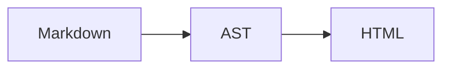

# MWRender Full Demo

[TOC]

## Inline Formatting

Strong **text**, *emphasis*, ~~deletion~~, `inline code`, and a
[safe link](https://example.com).

## Lists

- [x] Parse Markdown
- [x] Build an AST
- [x] Render deterministic HTML

## Table

| Capability | Available |
| :--- | ---: |
| Source ranges | Yes |
| Outline | Yes |
| Word statistics | Yes |

## Code

```cpp
mwrender::Engine engine;
```

## Math

Inline math: $a^2 + b^2 = c^2$.

$$
\sum_{i=1}^{n} i = \frac{n(n+1)}{2}
$$

## Mermaid



## Footnote

This document has a footnote.[^demo]

[^demo]: Footnotes include backlinks.
