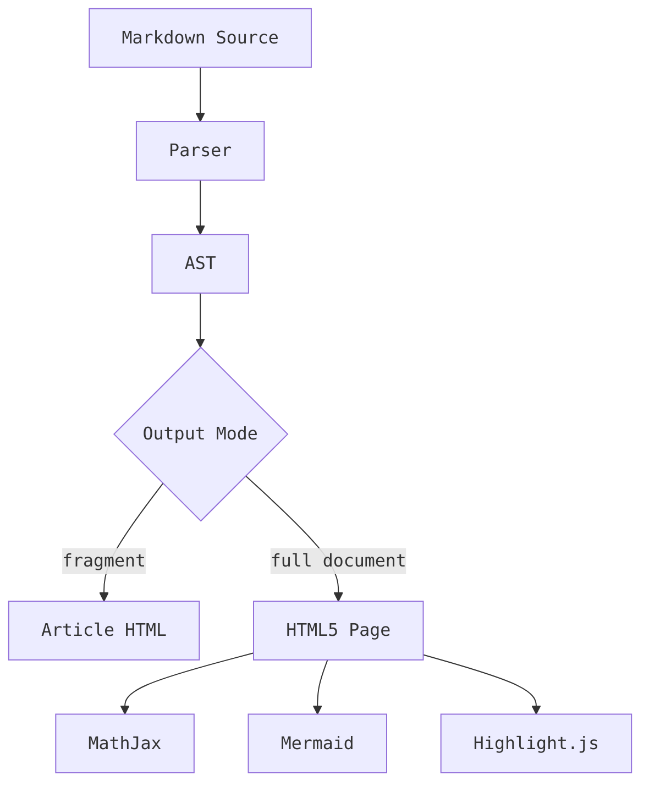
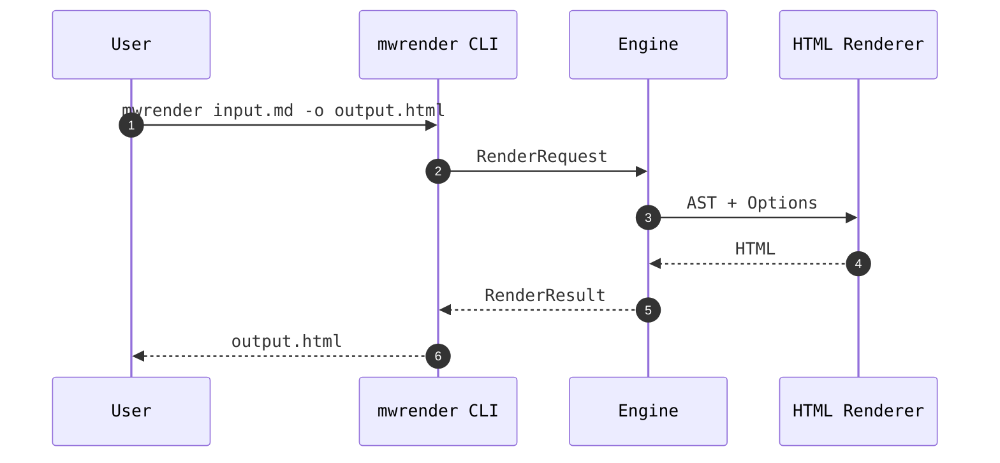
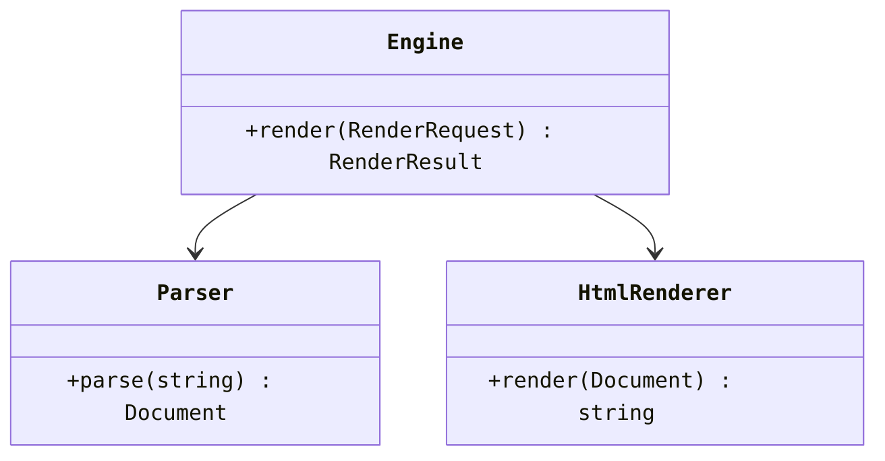
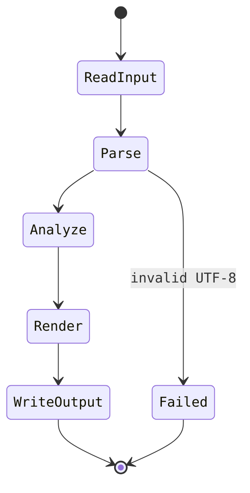
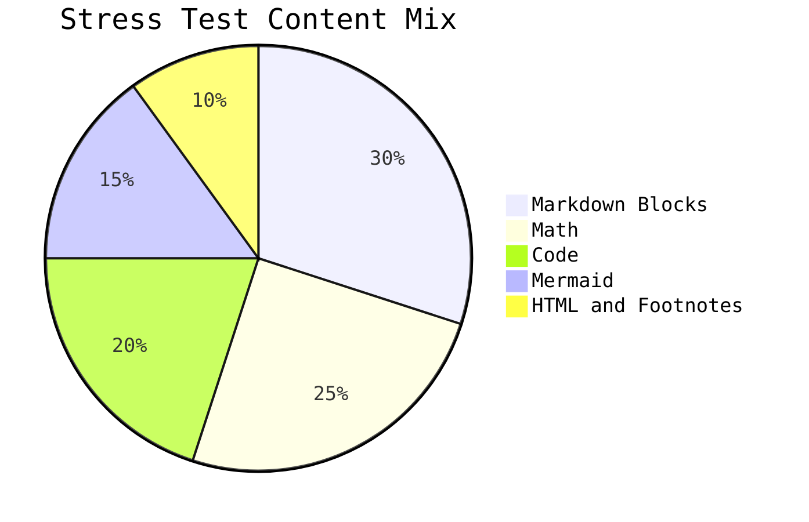
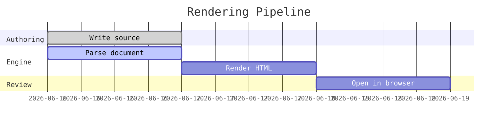

# MWRender Ultimate Markdown Stress Test

[TOC]

## 1. Paragraphs, Breaks, and Inline Syntax

This document is a deliberately dense Markdown sample for testing the renderer.
It mixes English, Chinese, punctuation, escaped characters, inline code, and math:
`std::vector<double>`, `a < b && b > c`, and `$E = mc^2$`.

Soft line break follows here
and should remain in the same paragraph.  
This line uses two trailing spaces before the newline, so it should become a hard break.

Escaped Markdown punctuation should show literal punctuation without the
escape backslash: \*literal asterisks\*, \_literal underscores\_,
\[literal brackets\], \(literal parentheses\), \`literal backticks\`, and \# literal hash.

Literal backslashes should remain visible in code spans:
`\*literal asterisks\*`, `\_literal underscores\_`, and `\# literal hash`.

Inline formatting matrix:

- **strong text**
- *emphasized text*
- ***strong plus emphasis***
- ~~strikethrough text~~
- `inline_code("with symbols: <>&")`
- [safe HTTPS link](https://example.com/path?q=markdown#fragment)
- <https://example.org/autolink>
- 

## 2. Heading Levels

### Level 3: Nested Section

#### Level 4: Duplicate Slug Test

##### Level 5: Duplicate Slug Test

###### Level 6: Deepest Supported Heading

### Level 3: Nested Section

Repeated headings above test slug de-duplication and outline generation.

---

## 3. Lists, Task Lists, and Mixed Nesting

- [x] Basic Markdown blocks
- [x] GFM extensions
- [x] Offline math, diagrams, and code highlighting
- [ ] Manual browser inspection

1. Ordered item with **bold**, `code`, and inline math $\omega = 2\pi f$.
2. Ordered item containing a nested unordered list:
   - Nested bullet A with a [link](https://example.net).
   - Nested bullet B with ~~deleted~~ text and `inline code`.
3. Ordered item containing another ordered list:
   1. Maxwell equation checkpoint.
   2. Hamiltonian checkpoint.
   3. Numerical method checkpoint.

> [!NOTE]
> GitHub alert syntax should render as a semantic note block when supported.
>
> - Alerts can contain lists.
> - Alerts can contain inline math such as $pV = nRT$.

> [!NOTE]
>
> Note alert body.

> [!TIP]
>
> Tip alert body.

> [!IMPORTANT]
>
> Important alert body.

> [!WARNING]
>
> Warning alert body.

> [!CAUTION]
>
> Caution alert body.

> A regular blockquote starts here.
>
> > A nested quote checks graceful handling of deeper blockquote structure.
>
> Back to the first quote level with **formatting** and `code`.

## 4. Tables and Alignment

| Feature         |        Example        |   Expected HTML Surface |
| :-------------- | :-------------------: | ----------------------: |
| Table alignment | left / center / right |               `<table>` |
| Inline code     |   `render(request)`   |                `<code>` |
| Math trigger    |        $x^2$          |                 MathJax |
| Mermaid trigger |   fenced `mermaid`    | SVG after client render |
| Autolink        | <https://example.com> |                   `<a>` |

| Physics Quantity  |  Symbol  | Formula                              | SI Unit |
| :---------------- | :------: | :----------------------------------- | ------: |
| Energy            |   $E$    | $E = mc^2$                           |       J |
| Momentum          | $\vec p$ | $\vec p = m\vec v$                   |  kg m/s |
| Angular frequency | $\omega$ | $\omega = 2\pi f$                    |   rad/s |
| Magnetic flux     | $\Phi_B$ | $\Phi_B = \int \vec B \cdot d\vec A$ |      Wb |

## 5. Code Blocks

Inline code with backticks inside text: `` `literal backtick content` ``.

```cpp
#include <cmath>
#include <iostream>
#include <vector>

struct Particle {
    double mass;
    double velocity;
};

double kinetic_energy(const Particle& p) {
    return 0.5 * p.mass * p.velocity * p.velocity;
}

int main() {
    std::vector<Particle> beam{{9.1093837e-31, 2.4e6}, {1.6726219e-27, 1.1e5}};
    for (const auto& p : beam) {
        std::cout << kinetic_energy(p) << '\n';
    }
}
```

```python
from dataclasses import dataclass
from math import exp

@dataclass
class State:
    t: float
    y: float

def euler_decay(y0: float, k: float, dt: float, steps: int) -> list[State]:
    y = y0
    out = []
    for n in range(steps + 1):
        t = n * dt
        out.append(State(t, y))
        y += -k * y * dt
    return out

print(euler_decay(1.0, 0.25, 0.1, 5))
print("analytic:", exp(-0.25 * 0.5))
```

```json
{
  "renderer": "MWRender",
  "features": ["tables", "tasks", "math", "mermaid", "highlight.js"],
  "htmlPolicy": "sanitized",
  "nested": {
    "depth": 3,
    "stable": true
  }
}
```

```bash
mwrender examples/ultimate-markdown-stress.md -o out/ultimate-markdown-stress.html --html-policy sanitized
```

## 6. Math and Physics Formula Gallery

Inline examples: the relativistic factor is $\gamma = \frac{1}{\sqrt{1-v^2/c^2}}$,
Planck's relation is $E = h\nu$, and the de Broglie wavelength is
$\lambda = \frac{h}{p}$.

Block equations:

$$
\nabla \cdot \vec{E} = \frac{\rho}{\varepsilon_0},
\qquad
\nabla \cdot \vec{B} = 0
$$

$$
\nabla \times \vec{E} = -\frac{\partial \vec{B}}{\partial t},
\qquad
\nabla \times \vec{B} =
\mu_0\vec{J} + \mu_0\varepsilon_0\frac{\partial \vec{E}}{\partial t}
$$

$$
i\hbar\frac{\partial}{\partial t}\Psi(\vec r,t)
=
\left[
-\frac{\hbar^2}{2m}\nabla^2 + V(\vec r,t)
\right]\Psi(\vec r,t)
$$

$$
\mathcal{L} =
-\frac{1}{4}F_{\mu\nu}F^{\mu\nu}
\quad + \bar{\psi}(i\gamma^\mu D_\mu - m)\psi
$$

$$
\begin{aligned}
Z &= \sum_s e^{-\beta E_s},\\
F &= -k_B T \ln Z,\\
\langle E \rangle &= -\frac{\partial}{\partial \beta}\ln Z.
\end{aligned}
$$

$$
\begin{bmatrix}
\cos\theta & -\sin\theta & 0\\
\sin\theta & \cos\theta & 0\\
0 & 0 & 1
\end{bmatrix}
\begin{bmatrix}
x\\ y\\ z
\end{bmatrix}
=
\begin{bmatrix}
x'\\ y'\\ z'
\end{bmatrix}
$$

## 7. Mermaid Diagrams and Charts

### Flowchart



### Sequence Diagram



### Class Diagram



### State Diagram



### Pie Chart



### Gantt Chart



## 8. Raw HTML Under Sanitized Policy

<details>
<summary>Expandable HTML details element</summary>

This block contains safe inline HTML: <kbd>Ctrl</kbd> + <kbd>K</kbd>,
<mark>highlighted text</mark>, <sub>subscript</sub>, and <sup>superscript</sup>.

</details>

<div>
  <p>Safe HTML paragraph inside a div.</p>
  <table>
    <tr><th>HTML Cell</th><th>Value</th></tr>
    <tr><td>alpha</td><td>1</td></tr>
  </table>
</div>

## 9. Footnotes

Footnotes are useful for academic notes, citations, and side comments.[^first]
Multiple references can point to separate notes.[^second]

[^first]: This is the first footnote. It includes **formatting**, `code`, and a formula $F = ma$.

[^second]: This is the second footnote, with a link to <https://example.edu>.

## 10. Mixed Stress Section

> ## Quoted Heading
>
> 1. A quoted ordered item.
> 2. Another quoted item with a nested bullet:
>    - Nested quoted bullet with $H\psi = E\psi$.
>
> ```text
> quoted fenced code should remain readable
> ```

Final checklist:

- [x] Headings from H1 to H6
- [x] Paragraphs, soft breaks, and hard breaks
- [x] Strong, emphasis, combined emphasis, inline code, links, images
- [x] Ordered lists, unordered lists, task lists
- [x] Blockquotes and alert-style blockquotes
- [x] Tables with alignment
- [x] Fenced code blocks in several languages
- [x] Inline and block math
- [x] Mermaid flowchart, sequence, class, state, pie, and gantt diagrams
- [x] Raw HTML under sanitized policy
- [ ] Footnotes
